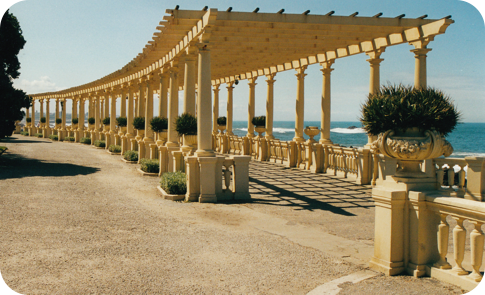

# JavaScript Libraries

The following are some JavaScript libraries that can be used in the context of VMware Aria Automation.

## LINQ

[linq](https://github.com/mihaifm/linq) is a JavaScript implementation of the .NET LINQ library.

You can find a [fork of linq](https://github.com/StSchnell/linq) here, with the additions to use it with the Rhino engine.

## Papa Parse

[Papa Parse](https://github.com/mholt/PapaParse) is a JavaScript library for parsing CSV or delimited text.

## XDate

[XDate](https://github.com/arshaw/xdate) is a JavaScript date library for parsing, formatting and manipulating dates.
